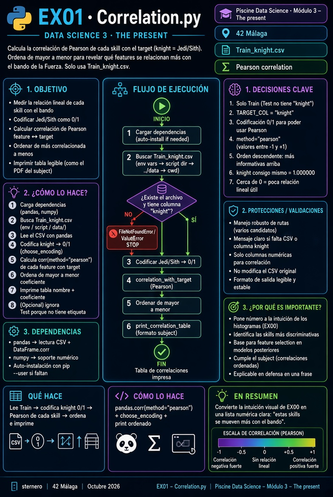

# 🐍 Guía Python – EX01 Correlation

<p align="center">
  
</p>

[← README EX01](./README.md)

---

<a id="indice"></a>
## 📑 Índice

1. [Lee esto primero](#lee)
2. [Qué pide el subject](#subject)
3. [Recordatorio: feature y target](#palabras)
4. [Qué es una correlación (sin fórmulas de miedo)](#corr)
5. [Por qué hay que convertir Jedi/Sith en números](#codigo-num)
6. [Qué hace `Correlation.py`](#programa)
7. [Recorrido del código](#codigo)
8. [Cómo ejecutar](#ejecutar)
9. [Cómo leer la tabla impresa](#tabla)
10. [Si algo falla](#fallos)
11. [Checklist](#checklist)
12. [Defensa](#defensa)

---

<a id="lee"></a>
## 1. Lee esto primero

No hace falta haber estudiado estadística. Basta con la idea:

> “Si cuando **sube** esta skill suele **cambiar** el bando de forma parecida, hay correlación alta.”

EX00 miraba histogramas a ojo. EX01 pone **un número** a esa intuición.

[↑ Índice](#indice)

---

<a id="subject"></a>
## 2. Qué pide el subject

| Requisito | En cristiano |
|-----------|--------------|
| `ex01/` · `Correlation.*` | Un programa que calcule e imprima correlaciones |
| Target = columna **`knight`** | Jedi / Sith |
| Features = el resto de columnas | Strength, Empowered, … |
| Entender las **más fuertes** | Ordenar de más correlacionada a menos |

El PDF muestra una lista de ejemplo. **Tus cifras no tienen que ser idénticas** (dependen del CSV), pero las skills de arriba del todo suelen ser las mismas familias (Empowered, Stims, Prescience…).

**Solo Train:** Test no tiene `knight`, no se puede correlacionar con el target.

[↑ Índice](#indice)

---

<a id="palabras"></a>
## 3. Recordatorio: feature y target

| Palabra | Aquí significa |
|---------|----------------|
| **Feature / skill** | Columna numérica que describe al caballero |
| **Target** | Columna `knight`: el **grupo** (Jedi o Sith) |

[↑ Índice](#indice)

---

<a id="corr"></a>
## 4. Qué es una correlación (sin fórmulas de miedo)

Imagina dos columnas de números. La **correlación de Pearson** (la habitual) da un valor entre **-1** y **+1**:

| Valor | Lectura intuitiva |
|------:|-------------------|
| **~ +1** | Cuando una sube, la otra tiende a subir |
| **~ 0** | No se ve relación lineal clara |
| **~ -1** | Cuando una sube, la otra tiende a bajar |

Analogía: altura y talla de zapato en adultos suelen ir **positivas**.  
Temperatura de la calefacción y abrigo puesto suelen ir **negativas**.

Aquí una de las dos “columnas” es el bando codificado como número.

[↑ Índice](#indice)

---

<a id="codigo-num"></a>
## 5. Por qué hay que convertir Jedi/Sith en números

Pearson habla de **números**. `Jedi` y `Sith` son texto.

Pearson es el nombre del tipo de correlación que estamos usando (la más habitual en este tipo de ejercicios).

Solución sencilla: asignar **0** a un bando y **1** al otro.  
El script elige la asignación de forma que el resultado se alinee con el sentido del ejemplo del subject (skills “fuertes” con coeficiente positivo alto, cuando es posible).

No es magia: es “poner etiquetas numéricas para poder medir”.

[↑ Índice](#indice)

---

<a id="programa"></a>
## 6. Qué hace `Correlation.py`

1. Encuentra y lee **Train_knight.csv**.  
2. Codifica `knight` → 0/1.  
3. Calcula la correlación de **cada** skill con ese target.  
4. Ordena de mayor a menor.  
5. Imprime una tabla `nombre  coeficiente`.

<p align="center">
  
</p>

[↑ Índice](#indice)

---

<a id="codigo"></a>
## 7. Recorrido del código

| Pieza | Rol |
|-------|-----|
| `find_csv` | Localiza el CSV (ex01/, data/, env del menú…) |
| `choose_encoding` | Decide 0/1 para Jedi/Sith |
| `correlation_with_target` | `DataFrame.corr` (Pearson) y ordena |
| `print_correlation_table` | Formato legible tipo subject |
| `main` | Orquesta todo |

Pandas hace el cálculo pesado: `work.corr(method="pearson")`.

[↑ Índice](#indice)

---

<a id="ejecutar"></a>
## 8. Cómo ejecutar

```bash
cd data_science_3_the_present/ex01
python3 Correlation.py
# o ./start.sh
```

[↑ Índice](#indice)

---

<a id="tabla"></a>
## 9. Cómo leer la tabla impresa

```text
knight          1.000000    ← el target consigo mismo (siempre 1)
Empowered       0.79...     ← muy ligada al bando
...
Survival       -0.04...     ← casi sin relación lineal (o débil)
```

- Arriba del todo (salvo `knight`): skills que **más** se mueven con el bando.  
- Cerca de 0: poco útiles **por sí solas** con una relación lineal simple.  
- Negativos suaves: relación inversa débil (según la codificación 0/1).

[↑ Índice](#indice)

---

<a id="fallos"></a>
## 10. Si algo falla

| Síntoma | Qué hacer |
|---------|-----------|
| No encuentra CSV | Copiar Train a `ex01/` o `../data/` / menú start.sh |
| Falta `knight` | Estás usando Test por error → usa **Train** |
| `No module named pandas` | `pip install --user pandas numpy` |

[↑ Índice](#indice)

---

<a id="checklist"></a>
## 11. Checklist

| Ítem | ☐ |
|------|---|
| `Correlation.*` en `ex01/` | ☐ |
| Salida ordenada feature ↔ `knight` | ☐ |
| Sabes decir qué es correlación en una frase | ☐ |

[↑ Índice](#indice)

---

<a id="defensa"></a>
## 12. Defensa (guion corto)

1. “El subject pide medir qué skills se relacionan más con el bando.”  
2. “Paso Jedi/Sith a 0 y 1 y uso correlación de Pearson.”  
3. “Imprimo de mayor a menor; arriba están las más informativas.”  
4. “Test no tiene etiqueta, por eso solo uso Train.”

[↑ Índice](#indice)

---

*Module 3 – EX01 – Guía Python · sternero – 42 Málaga – 2026*
