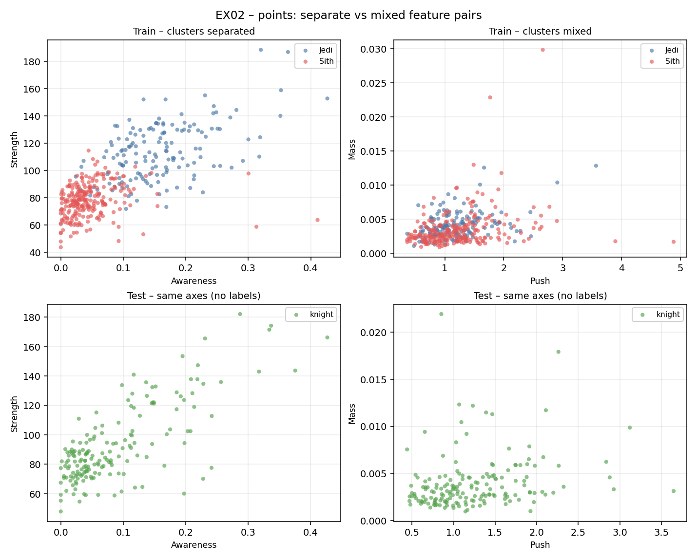

# 📍 Ejercicio 02 – points

<p align="center">
  
</p>

[← README Module 3](../README.md) · [Guía Python](./python.md)

---

## 🎯 Objetivo

Pasar de “una skill a la vez” (histogramas) y de “un número por skill” (correlación) a **ver dos skills a la vez** en un plano.

Cada caballero es un **punto**. Si en Train coloreamos por `knight`, se ve si Jedi y Sith forman grupos o se pisan.

---

## 📜 Subject (traducido)

| Campo | Valor |
|-------|--------|
| Directorio de entrega | `ex02/` |
| Fichero a entregar | **`points.*`** |
| Funciones permitidas | All |
| Datos | `Train_knight.csv` y `Test_knight.csv` |

Requisitos:

1. **4 gráficos** (como el ejemplo del PDF).  
2. Uso de **Train** y **Test**.  
3. De los dos tipos de gráfico: uno debe **separar** visualmente los clusters y el otro **mezclarlos**, **en cada fichero**.

---

## 🖼️ Qué debe verse (rejilla 2×2)

| | Par que **separa** | Par que **mezcla** |
|--|--------------------|--------------------|
| **Train** | Jedi / Sith en colores; nubes aparte | Mismos bandos; nubes solapadas |
| **Test** | Mismos ejes; **un** color (sin etiqueta) | Mismos ejes; **un** color |

En nuestro código:

| Par | Skills | Rol |
|-----|--------|-----|
| Separación | **Awareness × Strength** | Alta relación con el bando (EX01) |
| Mezcla | **Push × Mass** | Baja relación con el bando |

<p align="center">
  
</p>

---

## 📁 Archivos del ejercicio

| Archivo | Rol |
|---------|-----|
| [`points.py`](./points.py) | **Entrega** (`points.*`) |
| [`python.md`](./python.md) | Guía didáctica (scatter, clusters, código) |
| [`start.sh`](./start.sh) | Menú opcional (estado / ejecutar) |
| `imgs/points.png` | Captura generada (documentación) |

**Datos:** no se copian a `ex02/`. Se leen desde la carpeta compartida del módulo:

```text
data_science_3_the_present/data/Train_knight.csv
data_science_3_the_present/data/Test_knight.csv
```

(La misma `data/` que se rellena en EX00.)

---

## ▶️ Cómo ejecutar

```bash
cd data_science_3_the_present/ex02

# Opción A – directo
python3 points.py

# Opción B – solo PNG (sin ventana, p. ej. en cluster)
MPLBACKEND=Agg python3 points.py

# Opción C – menú
chmod +x start.sh && ./start.sh
```

Salida esperada:

- Mensajes con rutas a los CSV en `data/` y `shape` de Train/Test.  
- Fichero **`points.png`** en `ex02/` (y ventana si hay `DISPLAY`).

---

## 🧠 Idea rápida (puente con EX00 / EX01)

| Ejercicio | Pregunta |
|-----------|----------|
| EX00 | ¿Cómo se reparte **una** skill? (y con color de bando) |
| EX01 | ¿Qué skills van **más ligadas** al bando? (número r) |
| **EX02** | Si miro **dos** skills a la vez, ¿se ven los bandos **juntos o mezclados**? |

---

## 🎤 Defensa

Guion corto:

1. “Cada punto es un caballero; X e Y son dos skills.”  
2. “Un par separa Jedi/Sith; el otro los mezcla.”  
3. “Train lleva color por bando; Test no tiene `knight` → un color.”  
4. “Elegí ejes acordes a la correlación de EX01 (alta vs baja).”

Preguntas frecuentes:

| Pregunta | Respuesta orientativa |
|----------|------------------------|
| ¿Obliga el PDF a Awareness/Strength? | No; pide *ver* separación y mezcla. Esos pares lo cumplen. |
| ¿Por qué Test en verde? | No hay etiqueta; un solo color como en el ejemplo del subject. |
| ¿Hace falta Jupyter? | No; un script `points.*` basta. |

---

## ✅ Checklist antes de evaluar

| Ítem | ☐ |
|------|---|
| `points.*` dentro de `ex02/` | ☐ |
| 4 paneles generados (2 Train + 2 Test) | ☐ |
| Un par separa clusters y el otro los mezcla | ☐ |
| Test sin colores de bando | ☐ |
| CSV leídos desde `../data/` (o rutas equivalentes) | ☐ |
| Puedes explicar la elección de ejes | ☐ |

---

## 📎 Navegación

- [README Module 3](../README.md)  
- [EX01 Correlation](../ex01/README.md) · [EX00 Histogram](../ex00/README.md)  
- [Guía Python EX02](./python.md)

---

*Module 3 – EX02 – points · sternero – 42 Málaga – Octubre 2026*
