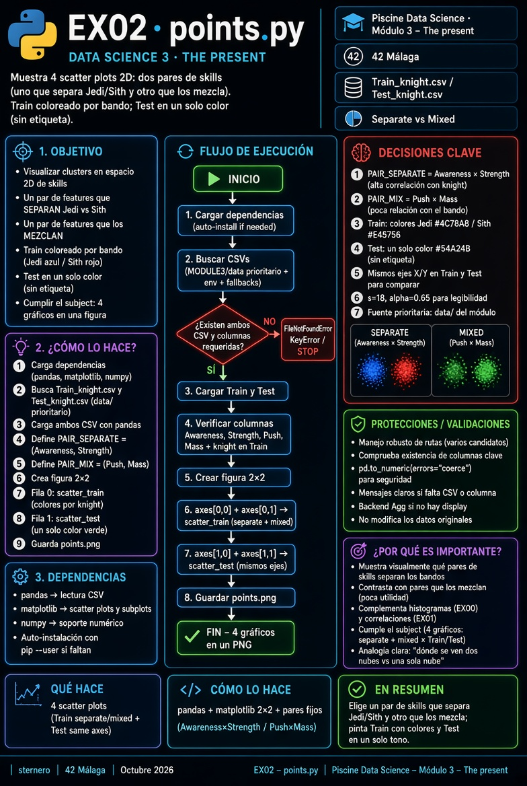

# 🐍 Guía Python – EX02 points

<p align="center">
  
</p>

[← README EX02](./README.md)

---

<a id="indice"></a>
## 📑 Índice

1. [Lee esto primero](#lee)
2. [De qué va EX02 (una frase)](#frase)
3. [Palabras que necesitas](#palabras)
4. [Qué es un scatter (gráfico de puntos)](#scatter)
5. [Qué pide el subject](#subject)
6. [Train vs Test en estos gráficos](#train-test)
7. [Separar clusters vs mezclarlos](#clusters)
8. [Por qué esos pares de skills](#pares)
9. [Qué hace `points.py` paso a paso](#programa)
10. [Recorrido del código](#codigo)
11. [Datos desde `data/`](#data)
12. [Cómo ejecutar y qué mirar](#ejecutar)
13. [Si algo falla](#fallos)
14. [Checklist](#checklist)
15. [Defensa](#defensa)

---

<a id="lee"></a>
## 1. Lee esto primero

No hace falta saber geometría avanzada ni machine learning.

Sí conviene haber visto:

- **EX00**: histogramas (cómo se reparte **una** skill).  
- **EX01**: correlación (qué skills van más ligadas al bando).

EX02 junta las dos ideas en un **plano**: dos skills a la vez y, si hay etiqueta, color por bando.

[↑ Índice](#indice)

---

<a id="frase"></a>
## 2. De qué va EX02 (una frase)

> **Dibujar cada caballero como un punto** (skill X, skill Y), cuatro veces: dos pares de skills × Train y Test, de modo que se vea un caso donde los bandos se **separan** y otro donde se **mezclan**.

[↑ Índice](#indice)

---

<a id="palabras"></a>
## 3. Palabras que necesitas

| Término | Significado aquí |
|---------|------------------|
| **Scatter / gráfico de puntos** | Cada fila del CSV es un punto en un plano |
| **Eje X / eje Y** | Dos skills numéricas elegidas |
| **Cluster** | Grupo de puntos que se ven juntos (aquí: Jedi o Sith) |
| **Separar** | Los dos bandos ocupan zonas distintas del plano |
| **Mezclar** | Los dos bandos se pisan; no se distinguen a simple vista |
| **Feature / skill** | Columna numérica (Awareness, Strength…) |
| **Target** | Columna `knight` (solo en Train) |

[↑ Índice](#indice)

---

<a id="scatter"></a>
## 4. Qué es un scatter (gráfico de puntos)

Imagina una hoja milimetrada:

1. Eliges dos columnas del CSV, p. ej. **Awareness** y **Strength**.  
2. Por cada fila (cada caballero):  
   - miras su Awareness → posición horizontal,  
   - miras su Strength → posición vertical,  
   - marcas un punto.

Si hay 398 filas en Train, hay hasta 398 puntos.

**No** es un histograma: el histograma resume **una** variable con barras de conteo.  
El scatter muestra **dos** variables a la vez y la posición de cada individuo.

Analogía: en un patio, cada alumno se coloca según “nota de mates” (X) y “nota de lengua” (Y). Si colorea por equipo, ves si los equipos se agrupan.

[↑ Índice](#indice)

---

<a id="subject"></a>
## 5. Qué pide el subject

Texto del PDF (resumido):

- Entrega: `ex02/` · **`points.*`**  
- **4 gráficos** con `Train_knight.csv` y `Test_knight.csv`  
- De los dos tipos de gráfico: uno debe **separar** visualmente los clusters y el otro **mezclarlos**, **para cada fichero**

En la práctica (como el ejemplo del PDF):

| Posición | Fichero | Idea |
|----------|---------|------|
| Arriba izquierda | Train | Par que **separa** + colores Jedi/Sith |
| Arriba derecha | Train | Par que **mezcla** + colores |
| Abajo izquierda | Test | Mismo par de separación, **un** color |
| Abajo derecha | Test | Mismo par de mezcla, **un** color |

Test no tiene `knight` → no se puede colorear por bando; el PDF los pinta todos iguales (p. ej. verde) con leyenda genérica `knight`.

<p align="center">
  
</p>

[↑ Índice](#indice)

---

<a id="train-test"></a>
## 6. Train vs Test en estos gráficos

| | Train | Test |
|--|:-----:|:----:|
| Skills en los ejes | Sí | Sí (mismos nombres) |
| Columna `knight` | **Sí** → color azul/rojo | **No** → un solo color |
| Objetivo visual | Ver clusters | Ver la misma “nube” sin etiquetas |

Misma plantilla de ejes en Train y Test para poder comparar “con etiqueta” vs “sin etiqueta”.

[↑ Índice](#indice)

---

<a id="clusters"></a>
## 7. Separar clusters vs mezclarlos

**Separar:** en el plano, la nube Jedi y la Sith se ven en zonas distintas (poco solapadas).  
Eso suele pasar con skills que en EX01 tenían **|r| alto** con el bando.

**Mezclar:** las dos nubes ocupan casi el mismo sitio.  
Suele pasar con skills de **|r| bajo** en EX01.

EX02 no calcula la correlación otra vez: **elige** pares y **muestra** el efecto a ojo.  
Es el puente visual entre histogramas (EX00), números (EX01) y el plano 2D.

[↑ Índice](#indice)

---

<a id="pares"></a>
## 8. Por qué esos pares de skills

En `points.py` hay dos constantes:

```python
PAIR_SEPARATE = ("Awareness", "Strength")
PAIR_MIX = ("Push", "Mass")
```

| Par | Rol | Motivo didáctico |
|-----|-----|------------------|
| Awareness × Strength | Separación | Muy ligadas al bando (EX01); se parece al ejemplo del PDF (ejes “pequeño × grande”) |
| Push × Mass | Mezcla | Casi independientes del bando; nubes solapadas |

No son los únicos pares válidos. El subject no fija los nombres: pide que **se vea** separación y mezcla.  
Si cambias los pares, mantén ese criterio (y que las columnas existan en Train y Test).

[↑ Índice](#indice)

---

<a id="programa"></a>
## 9. Qué hace `points.py` paso a paso

1. Localiza `Train_knight.csv` y `Test_knight.csv` (preferencia: carpeta **`data/`**).  
2. Lee ambos con pandas.  
3. Comprueba que existen las columnas de los dos pares y que Train tiene `knight`.  
4. Crea una figura **2×2**:  
   - fila superior = Train (coloreado),  
   - fila inferior = Test (un color).  
5. Guarda `points.png` y, si hay pantalla, muestra la ventana.

[↑ Índice](#indice)

---

<a id="codigo"></a>
## 10. Recorrido del código

| Pieza | Trabajo |
|-------|---------|
| `ensure_dependencies` | Instala pandas/matplotlib/numpy si faltan |
| `find_csv` | Busca primero en `../data/` (misma idea que EX01) |
| `PAIR_SEPARATE` / `PAIR_MIX` | Los dos pares de ejes |
| `scatter_train` | Puntos por bando (colores distintos + leyenda) |
| `scatter_test` | Todos los puntos del mismo color |
| `main` | Orquesta lectura, rejilla 2×2, `savefig` |

Idea de `scatter_train`:

```python
for label in ["Jedi", "Sith"]:
    sub = df[df["knight"] == label]
    ax.scatter(sub[x_col], sub[y_col], label=label, ...)
```

Cada bando se dibuja en su color. En Test no hay bucle por etiqueta: un solo `scatter`.

La rejilla:

```python
fig, axes = plt.subplots(2, 2, ...)
# axes[0, 0] Train separado
# axes[0, 1] Train mezclado
# axes[1, 0] Test (mismos ejes que separado)
# axes[1, 1] Test (mismos ejes que mezclado)
```

[↑ Índice](#indice)

---

<a id="data"></a>
## 11. Datos desde `data/`

No hace falta tener CSV dentro de `ex02/`.

Orden de búsqueda (resumido):

1. `data_science_3_the_present/data/Train_knight.csv` (y Test)  
2. Variables de entorno del menú, si existen  
3. Otros fallbacks (raíz del módulo, cwd…)

Si falta el fichero: sincroniza con el menú de EX00 o copia los CSV a **`data/`**.

[↑ Índice](#indice)

---

<a id="ejecutar"></a>
## 12. Cómo ejecutar y qué mirar

```bash
cd data_science_3_the_present/ex02
# Con ventana (si hay DISPLAY):
python3 points.py
# Solo PNG (cluster / sin pantalla):
MPLBACKEND=Agg python3 points.py
```

Comprueba en `points.png`:

- Arriba: dos colores y leyenda Jedi/Sith.  
- Un panel con nubes **aparte**, otro **solapadas**.  
- Abajo: un color; mismos títulos de ejes que arriba.

[↑ Índice](#indice)

---

<a id="fallos"></a>
## 13. Si algo falla

| Síntoma | Qué hacer |
|---------|-----------|
| No encuentra CSV | Crear/rellenar `../data/` con Train y Test |
| `KeyError` de una skill | El nombre del par no existe en el CSV; revisa cabecera |
| `No module named matplotlib` | `pip install --user matplotlib pandas numpy` |
| No se crea `points.png` | Leer el traceback; probar `MPLBACKEND=Agg` |

[↑ Índice](#indice)

---

<a id="checklist"></a>
## 14. Checklist

| Ítem | ☐ |
|------|---|
| Entrega `points.*` en `ex02/` | ☐ |
| 4 paneles (2 Train + 2 Test) | ☐ |
| Un par separa, otro mezcla | ☐ |
| Test sin colores de bando (sin etiqueta) | ☐ |
| Sabes explicar por qué elegiste esos ejes | ☐ |

[↑ Índice](#indice)

---

<a id="defensa"></a>
## 15. Defensa (guion corto)

1. “Cada punto es un caballero; X e Y son dos skills.”  
2. “Un par está muy ligado al bando (EX01) y se ve separación; el otro casi no y se mezclan.”  
3. “En Train coloreo Jedi/Sith; en Test no hay `knight`, un solo color.”  
4. “Así se ve en 2D lo que los histogramas y la correlación ya sugerían.”

Si preguntan *¿por qué Awareness y Strength?*:  
“Tienen correlación alta con el target; el PDF muestra un par de ese estilo.”

Si preguntan *¿por qué Push y Mass?*:  
“Correlación baja con el bando; sirven de contrapunto visual.”

[↑ Índice](#indice)

---

*Module 3 – EX02 – Guía Python · sternero – 42 Málaga – Octubre 2026*
