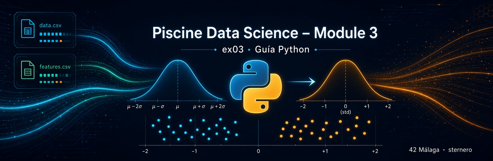
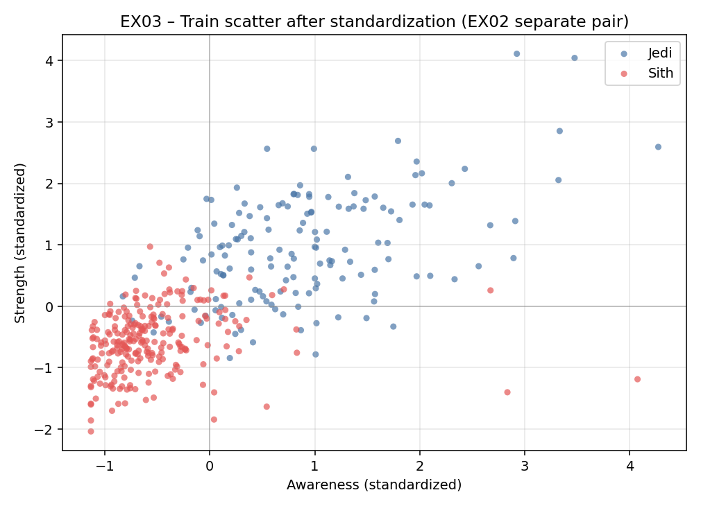
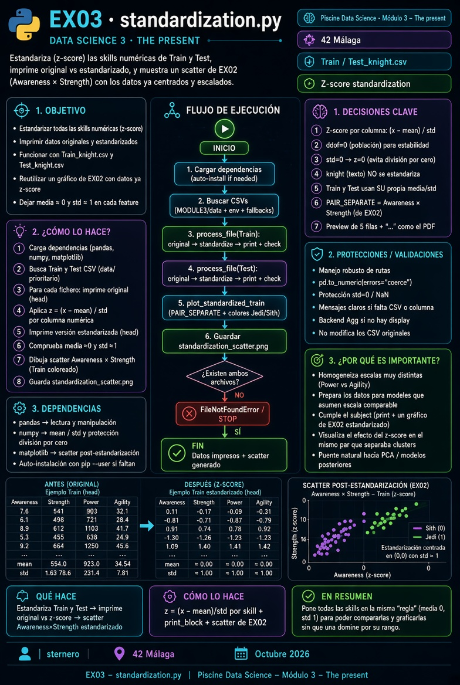

# 🐍 Guía Python – EX03 standardization

<p align="center">
  
</p>

[← README EX03](./README.md)

---

## 📑 Índice

1. [Lee esto primero](#lee)
2. [Qué pide el subject](#subject)
3. [Por qué estandarizar](#por-que)
4. [Fórmula z-score](#formula)
5. [Qué no se estandariza](#knight)
6. [Train y Test](#train-test)
7. [El gráfico de EX02 reutilizado](#grafico)
8. [Qué hace el programa](#programa)
9. [Código (mapa)](#codigo)
10. [Ejecutar](#ejecutar)
11. [Fallos](#fallos)
12. [Checklist y defensa](#defensa)

---

<a id="lee"></a>

## 1. Lee esto primero

En EX00–EX02 las skills tenían **unidades distintas** (Strength ~100, Agility ~0.1).  
Eso no impide histogramas ni correlaciones, pero complica comparar “quién se mueve más”.

**Estandarizar** = reescribir cada skill para que tenga media ≈ 0 y dispersión ≈ 1.

---

<a id="subject"></a>

## 2. Qué pide el subject

| Requisito | Cómo lo cubrimos |
|-----------|------------------|
| Standardize and **print** | Consola: bloque original + bloque z-score |
| **One** graph from EX02 with standardized data | Scatter Awareness × Strength (par “separación”) en Train |
| Train **and** Test | Ambos se leen, se transforman y se imprimen |

---

<a id="por-que"></a>

## 3. Por qué estandarizar

Analogía: comparar altura en metros y peso en gramos en la misma gráfica es engañoso.  
Si restas la media y divides por la desviación, ambos ejes hablan el mismo idioma: **“cuántas desviaciones por encima/debajo de la media”**.

---

<a id="formula"></a>

## 4. Fórmula z-score

\[
z = \frac{x - \mu}{\sigma}
\]

| Símbolo | Significado |
|---------|-------------|
| \(x\) | Valor original de la skill en una fila |
| \(\mu\) | Media de esa skill en el CSV |
| \(\sigma\) | Desviación típica de esa skill |
| \(z\) | Valor estandarizado |

Tras aplicar esto a **todas** las filas de una columna:

- media de los \(z\) ≈ 0  
- desviación de los \(z\) ≈ 1  

Si \(\sigma = 0\) (columna constante), se deja \(z = 0\).

---

<a id="knight"></a>

## 5. Qué no se estandariza

La columna **`knight`** es texto (Jedi/Sith). No entra en la fórmula.  
Se copia igual en la tabla impresa y se usa solo para **colorear** el scatter de Train.

---

<a id="train-test"></a>

## 6. Train y Test

Cada fichero se estandariza con **su propia** media y std (como “print your data” por dataset).

No es el único enfoque posible en ML (a veces se aprende \(\mu,\sigma\) solo en Train y se aplican a Test); el subject no exige ese matiz: pide ver los datos estandarizados de ambos CSV.

---

<a id="grafico"></a>

## 7. El gráfico de EX02 reutilizado

Subject: *“Display **one** of the graphs from the previous exercise with the standardized data.”*

Reutilizamos el par de **separación** de EX02:

```text
Awareness (eje X) × Strength (eje Y)
```

Solo cambia que los valores ya son **z-score**. Los clusters deberían seguir visibles (la estandarización no mezcla bandos; solo cambia la escala de los ejes).

<p align="center">
  
</p>

---

<a id="programa"></a>

## 8. Qué hace el programa

1. Lee Train y Test desde `../data/`.  
2. Imprime primeras filas **originales**.  
3. Calcula z-score por skill.  
4. Imprime primeras filas **estandarizadas**.  
5. Dibuja el scatter de Train estandarizado → `standardization_scatter.png`.

<p align="center">
  
</p>

---

<a id="codigo"></a>

## 9. Código (mapa)

| Función | Rol |
|---------|-----|
| `find_csv` | Prioriza `data/` del módulo |
| `feature_columns` | Todas las columnas excepto `knight` |
| `standardize_features` | Z-score columna a columna |
| `print_block` | Salida tipo subject |
| `plot_standardized_train` | Scatter EX02 con datos z |
| `main` | Orquesta Train + Test + gráfico |

Núcleo:

```python
z = (columna - columna.mean()) / columna.std()
```

---

<a id="ejecutar"></a>

## 10. Ejecutar

```bash
cd data_science_3_the_present/ex03
python3 standardization.py
# o: MPLBACKEND=Agg python3 standardization.py
```

---

<a id="fallos"></a>

## 11. Fallos

| Síntoma | Qué hacer |
|---------|-----------|
| CSV no encontrado | Rellenar `../data/` (EX00) |
| Media no ~0 tras z | Comprobar que no estés mirando `knight` |
| Sin PNG | `MPLBACKEND=Agg` y leer traceback |

---

<a id="defensa"></a>

## 12. Checklist y defensa

**Checklist:** entrega `standardization.*` · print antes/después · Train y Test · un scatter EX02 con z-score.

**Defensa:**

1. “Z-score: resto la media y divido por la std de cada skill.”  
2. “Así todas quedan en escala comparable (≈ N(0,1)).”  
3. “Imprimo original y transformado para Train y Test.”  
4. “Repito el scatter de separación de EX02 con esos valores.”

---

*Module 3 – EX03 – Guía Python · sternero – 42 Málaga – Octubre 2026*
