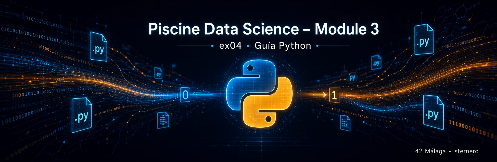
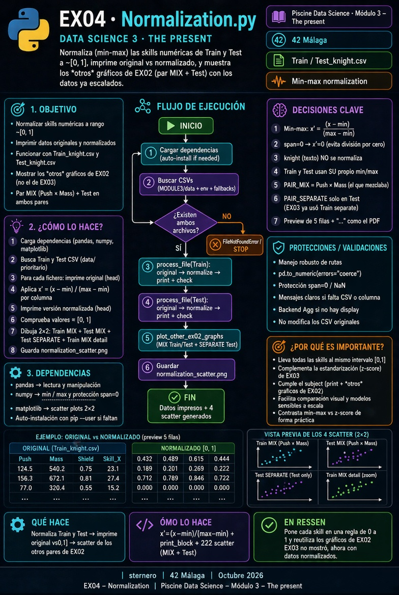

# 🐍 Guía Python – EX04 Normalization

<p align="center">
  
</p>

[← README EX04](./README.md)

---

<a id="indice"></a>

## 📑 Índice

1. [Lee esto primero](#lee)
2. [Qué pide el subject](#subject)
3. [Normalizar ≠ estandarizar](#diff)
4. [Fórmula min-max](#formula)
5. [Qué no se normaliza](#knight)
6. [“The other graphs” de EX02](#otros)
7. [Train y Test](#train-test)
8. [Qué hace el programa](#programa)
9. [Mapa del código](#codigo)
10. [Ejecutar](#ejecutar)
11. [Fallos](#fallos)
12. [Checklist y defensa](#defensa)

---

<a id="lee"></a>

## 1. Lee esto primero

EX03 puso las skills en escala “media 0, std 1” (z-score).  
EX04 las pone en **[0, 1]** (min-max). Misma idea de “hablar el mismo idioma”, **otra regla**.

[↑ Índice](#indice)

---

<a id="subject"></a>

## 2. Qué pide el subject

| Requisito | Cómo |
|-----------|------|
| Normalize and **print** | Consola: original + valores ≈ [0, 1] |
| **Other graphs** from EX02 | Par que **mezcla** (+ paneles Test) |
| Train **and** Test | Ambos se transforman e imprimen |

El ejemplo del PDF muestra números tipo `0.52 0.02 0.54` → escala acotada, típica de min-max.

---

<a id="diff"></a>

## 3. Normalizar ≠ estandarizar

| | Estandarizar (EX03) | **Normalizar (EX04)** |
|--|---------------------|------------------------|
| Fórmula | \((x-\mu)/\sigma\) | \((x-\min)/(\max-\min)\) |
| Resultado | centrado, std ≈ 1 | **entre 0 y 1** (si min≠max) |
| Útil para | comparar dispersión | acotar rango (redes, distancias…) |

Analogía: estandarizar es “cuántas desviaciones respecto a la media”;  
normalizar es “en qué tanto por ciento del recorrido min→max estás”.

---

<a id="formula"></a>

## 4. Fórmula min-max

\[
x' = \frac{x - \min(x)}{\max(x) - \min(x)}
\]

- Si \(x = \min\) → \(x' = 0\)  
- Si \(x = \max\) → \(x' = 1\)  
- Si toda la columna es constante → se deja \(0\) (evitar dividir por cero)

---

<a id="knight"></a>

## 5. Qué no se normaliza

**`knight`** es texto (Jedi/Sith). Solo se usa para colorear en Train.

---

<a id="otros"></a>

## 6. “The other graphs” de EX02

| Ejercicio | Qué gráfico de EX02 |
|-----------|---------------------|
| EX03 | **Uno**: par que **separa** (Awareness × Strength), Train |
| **EX04** | **Los otros**: par que **mezcla** (Push × Mass) en Train y Test; y Test con el par separación |

Así se cubre el subject sin repetir solo el mismo panel de EX03.

---

<a id="train-test"></a>

## 7. Train y Test

Cada fichero se normaliza con **su** min y max por columna (print your data por dataset).

---

<a id="programa"></a>

## 8. Qué hace el programa

1. Lee Train y Test desde `../data/`.  
2. Imprime filas originales.  
3. Aplica min-max a cada skill.  
4. Imprime filas normalizadas.  
5. Dibuja los scatters “otros” de EX02 → `normalization_scatter.png`.

<p align="center">
  
</p>

---

<a id="codigo"></a>

## 9. Mapa del código

| Pieza | Rol |
|-------|-----|
| `find_csv` | Prioriza `data/` |
| `normalize_features` | Min-max por columna |
| `print_block` | Salida tipo subject |
| `plot_other_ex02_graphs` | Scatters EX02 restantes |
| `main` | Orquesta todo |

```python
x_norm = (x - x.min()) / (x.max() - x.min())
```

---

<a id="ejecutar"></a>

## 10. Ejecutar

```bash
cd data_science_3_the_present/ex04
python3 Normalization.py
# o: MPLBACKEND=Agg python3 Normalization.py
```

---

<a id="fallos"></a>

## 11. Fallos

| Síntoma | Qué hacer |
|---------|-----------|
| CSV no encontrado | Rellenar `../data/` |
| Valores fuera de [0,1] | Revisar que no mires `knight` |
| Sin PNG | `MPLBACKEND=Agg` |

---

<a id="defensa"></a>

## 12. Checklist y defensa

**Checklist:** `Normalization.*` · print antes/después · Train y Test · otros gráficos EX02.

**Defensa:**

1. “Min-max: resto el mínimo y divido por (máx − mín).”  
2. “Cada skill queda en [0, 1].”  
3. “EX03 usó z-score y el scatter que separa; aquí normalizo y muestro los otros de EX02.”  
4. “Imprimo original y normalizado para Train y Test.”

---

*Module 3 – EX04 – Guía Python · sternero – 42 Málaga – Octubre 2026*
