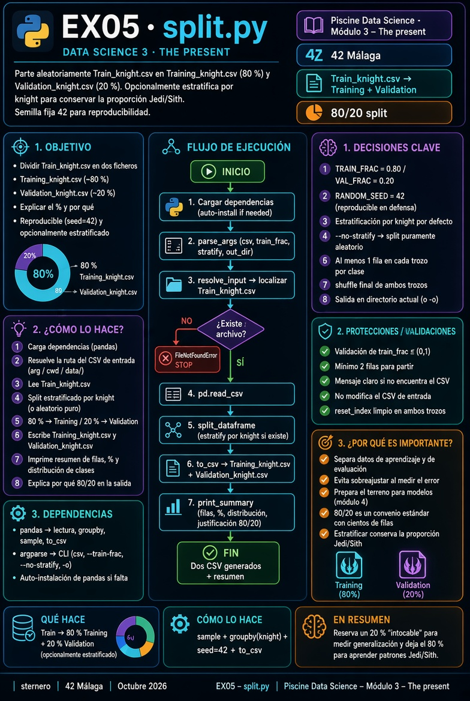

# 🐍 Guía Python – EX05 Split

<p align="center">
  
</p>

[← README EX05](./README.md)

---

<a id="indice"></a>
## 📑 Índice

1. [Lee esto primero](#lee)
2. [De qué va EX05 (una frase)](#frase)
3. [Palabras que necesitas](#palabras)
4. [Qué pide el subject](#subject)
5. [Training vs Validation vs Test](#tres)
6. [Por qué partir el Train](#por-que)
7. [Porcentajes: 80 % / 20 %](#porcentajes)
8. [Aleatorio y semilla](#semilla)
9. [Estratificar por `knight`](#estratificar)
10. [Qué hace `split.py` paso a paso](#programa)
11. [Recorrido del código](#codigo)
12. [Cómo ejecutar](#ejecutar)
13. [Qué debes ver al terminar](#salida)
14. [Si algo falla](#fallos)
15. [Checklist](#checklist)
16. [Defensa](#defensa)

---

<a id="lee"></a>
## 1. Lee esto primero

No hace falta saber machine learning avanzado.

Sí conviene tener claro:

- **Train** = caballeros **con** etiqueta Jedi/Sith (lo usamos en EX00–EX04).  
- **Test** = caballeros **sin** etiqueta (solo skills).

EX05 no dibuja gráficos: **corta el Train** en dos montones para practicar una idea que verás mucho en el módulo 4 (entrenar con uno, comprobar con el otro).

[↑ Índice](#indice)

---

<a id="frase"></a>
## 2. De qué va EX05 (una frase)

> **Barajar** las filas de `Train_knight.csv` y guardar ~80 % en `Training_knight.csv` y ~20 % en `Validation_knight.csv`, sabiendo explicar por qué ese reparto.

[↑ Índice](#indice)

---

<a id="palabras"></a>
## 3. Palabras que necesitas

| Término | Significado aquí |
|---------|------------------|
| **Split** | Partir un conjunto de datos en varios trozos |
| **Training** | Trozos “para aprender” (la mayoría de filas) |
| **Validation** | Trozos “para comprobar” sin usarlos al ajustar |
| **Test** | Fichero aparte del subject (`Test_knight.csv`), **sin** `knight` |
| **Aleatorio** | No coger siempre las primeras N filas del CSV |
| **Semilla (seed)** | Número que fija el generador de azar → mismo resultado al repetir |
| **Estratificar** | Partir **dentro de cada clase** (Jedi y Sith) para no desequilibrar |
| **Fracción** | Tanto por uno: `0.80` = 80 % |

[↑ Índice](#indice)

---

<a id="subject"></a>
## 4. Qué pide el subject

| Campo | Valor |
|-------|--------|
| Directorio | `ex05/` |
| Entrega | **`split.*`** |
| Entrada | `Train_knight.csv` |
| Salidas | `Training_knight.csv` y `Validation_knight.csv` |

Comportamiento esperado (PDF):

```text
$> ./split.* Train_knight.csv
$> ls
./split.* Train_knight.csv Training_knight.csv Validation_knight.csv
```

Además: **debes poder explicar** qué porcentaje va a cada fichero y **por qué**.

El subject **no** impone 70/30 ni 80/20: impone que elijas un reparto y lo justifiques.

[↑ Índice](#indice)

---

<a id="tres"></a>
## 5. Training vs Validation vs Test

| Conjunto | ¿De dónde sale? | ¿Tiene `knight`? | Para qué sirve (idea) |
|----------|-----------------|------------------|------------------------|
| **Train** (original) | CSV del subject | Sí | Todo el material etiquetado |
| **Training** | Parte del Train | Sí | Aprender patrones |
| **Validation** | Otra parte del Train | Sí | Estimar si generaliza **sin** usar esas filas al ajustar |
| **Test** | `Test_knight.csv` | **No** | Predicción “a ciegas” (módulo 4) |

Analogía del examen:

1. **Training** = apuntes y ejercicios con solución.  
2. **Validation** = simulacro: ya sabes la nota, pero no deberías “memorizar” solo esas preguntas.  
3. **Test** = examen oficial sin mirar soluciones (en este módulo el Test ni trae la etiqueta).

[↑ Índice](#indice)

---

<a id="por-que"></a>
## 6. Por qué partir el Train

Si usas **todas** las filas etiquetadas para “aprender” y luego mides el acierto sobre las **mismas** filas, puedes creerte muy bueno solo porque el modelo se aprendió de memoria esos ejemplos.

Al **reservar** un trozo (Validation):

- Ajustas o exploras con Training.  
- Mides con filas que **no** entraron en ese ajuste.  
- Te acercas más a “¿funcionará con caballeros nuevos?”.

EX05 solo prepara los ficheros; el uso intensivo de Training/Validation aparece sobre todo al predecir (módulo 4).

[↑ Índice](#indice)

---

<a id="porcentajes"></a>
## 7. Porcentajes: 80 % / 20 %

En nuestro código, por defecto:

| Fichero | Fracción | Con ~398 filas |
|---------|----------|----------------|
| `Training_knight.csv` | **80 %** | ≈ 318–320 |
| `Validation_knight.csv` | **20 %** | ≈ 78–80 |

**Por qué este reparto (guion de defensa):**

1. **Training necesita ser grande** — con pocos ejemplos cuesta ver el patrón Jedi/Sith.  
2. **Validation debe ser suficiente** — si dejas solo 5 filas, la “nota” del simulacro salta mucho por azar.  
3. **80/20 (o 70/30)** es un **convenio** habitual cuando hay cientos de filas, no una ley matemática del subject.  
4. Si el dataset fuera enorme (millones de filas), a veces se usa 90/10 o menos % de validación; aquí ~400 filas → 20 % sigue siendo manejable.

Puedes cambiar la fracción:

```bash
python3 split.py Train_knight.csv --train-frac 0.7
```

[↑ Índice](#indice)

---

<a id="semilla"></a>
## 8. Aleatorio y semilla

**Mal split (sesgado):** quedarte con las primeras 80 % filas del CSV.  
Si el fichero está ordenado (p. ej. todos los Sith primero), Training y Validation no representarían lo mismo.

**Bien:** **barajar** las filas y luego cortar.

**Semilla (`RANDOM_SEED = 42`):**

- El “azar” en el ordenador es reproducible si fijas la semilla.  
- En defensa, al ejecutar dos veces, salen los **mismos** Training y Validation.  
- Facilita que evaluador y tú veáis el mismo conteo de filas.

[↑ Índice](#indice)

---

<a id="estratificar"></a>
## 9. Estratificar por `knight`

El Train no está equilibrado (hay más Sith que Jedi).

Si partes al azar **sin mirar el bando**, podrías tener mala suerte: Validation casi solo Sith, Training casi solo Jedi (o al revés).

**Estratificar** = para cada valor de `knight`:

1. Barajar las filas de ese bando.  
2. Dar ~80 % a Training y ~20 % a Validation.  
3. Unir los trozos de todos los bandos.

Así ambos ficheros conservan una proporción Jedi/Sith **parecida** a la del Train completo.

Desactivar (solo azar global):

```bash
python3 split.py Train_knight.csv --no-stratify
```

[↑ Índice](#indice)

---

<a id="programa"></a>
## 10. Qué hace `split.py` paso a paso

1. Lee la ruta del CSV (argumento o búsqueda en cwd / `data/`).  
2. Carga el Train con pandas.  
3. Baraja (con semilla) y corta — por defecto **estratificando** por `knight`.  
4. Escribe `Training_knight.csv` y `Validation_knight.csv` (sin la columna índice de pandas).  
5. Imprime resumen: filas, %, conteo por bando y la justificación del 80/20.

<p align="center">
  
</p>

[↑ Índice](#indice)

---

<a id="codigo"></a>
## 11. Recorrido del código

| Pieza | Trabajo |
|-------|---------|
| `TRAIN_FRAC` / `VAL_FRAC` | 0.80 / 0.20 — lo que defenderás |
| `RANDOM_SEED` | 42 — reproducibilidad |
| `resolve_input` | Encuentra el fichero de entrada |
| `split_dataframe` | Baraja + corte (estratificado o no) |
| `print_summary` | Texto listo para la defensa |
| `main` | CLI (`argparse`) + `to_csv` |

Idea central (sin estratificar):

```python
shuffled = df.sample(frac=1.0, random_state=42)
n_tr = int(round(len(df) * 0.80))
training = shuffled.iloc[:n_tr]
validation = shuffled.iloc[n_tr:]
```

Con estratificación se hace el mismo razonamiento **dentro** de cada grupo `knight`.

[↑ Índice](#indice)

---

<a id="ejecutar"></a>
## 12. Cómo ejecutar

Como el subject (desde `ex05/` con el CSV a mano):

```bash
cd data_science_3_the_present/ex05
cp ../data/Train_knight.csv .
python3 split.py Train_knight.csv
# o: ./split.py Train_knight.csv   (si tiene +x)
ls Training_knight.csv Validation_knight.csv
```

Otras formas útiles:

```bash
# Ruta directa a data/
python3 split.py ../data/Train_knight.csv -o .

# 70 % training
python3 split.py Train_knight.csv --train-frac 0.7
```

[↑ Índice](#indice)

---

<a id="salida"></a>
## 13. Qué debes ver al terminar

En consola, algo en esta línea:

- Filas totales del Train (p. ej. 398).  
- Training ≈ 80 %, Validation ≈ 20 %.  
- Conteos Jedi/Sith en cada trozo (si estratificas, proporciones similares).  
- Frases “Por qué este %”.

En disco:

```text
Training_knight.csv
Validation_knight.csv
```

Misma cabecera que el Train; la suma de filas debe ser la del original.

[↑ Índice](#indice)

---

<a id="fallos"></a>
## 14. Si algo falla

| Síntoma | Qué hacer |
|---------|-----------|
| `FileNotFoundError` | Pasa la ruta: `python3 split.py ../data/Train_knight.csv` |
| `No module named pandas` | `pip install --user pandas` |
| Solo un fichero de salida | Leer el traceback; comprobar permisos de escritura en el directorio |
| % muy raros | Revisar `--train-frac` (debe estar entre 0 y 1, excluido) |

[↑ Índice](#indice)

---

<a id="checklist"></a>
## 15. Checklist

| Ítem | ☐ |
|------|---|
| Entrega `split.*` en `ex05/` | ☐ |
| Genera `Training_knight.csv` y `Validation_knight.csv` | ☐ |
| El split es aleatorio (no “las primeras N filas”) | ☐ |
| Sabes el % (80/20) y **por qué** | ☐ |
| Puedes hablar de semilla y/o estratificación | ☐ |

[↑ Índice](#indice)

---

<a id="defensa"></a>
## 16. Defensa (guion)

1. “Parto el Train al azar en Training (~80 %) y Validation (~20 %).”  
2. “Training sirve para aprender; Validation para medir sin usar esas filas al ajustar.”  
3. “80/20 es un convenio razonable con ~400 ejemplos: train grande, val estable.”  
4. “Uso semilla 42 para que el corte sea reproducible en la evaluación.”  
5. “Estratifico por `knight` para no desequilibrar Jedi y Sith entre los dos ficheros.”

**Preguntas frecuentes**

| Pregunta | Respuesta orientativa |
|----------|------------------------|
| ¿El subject exige 80/20? | No; exige explicar el % que elijas. |
| ¿Validation es lo mismo que Test? | No. Test es otro CSV sin etiqueta. Validation sale del Train y sí tiene `knight`. |
| ¿Por qué no 50/50? | Validarías con mucho dato, pero el training se queda corto para aprender. |
| ¿Hay que subir los CSV generados? | La entrega es `split.*`; los CSV se generan al ejecutar. |

[↑ Índice](#indice)

---

*Module 3 – EX05 – Guía Python · sternero – 42 Málaga – Octubre 2026*
